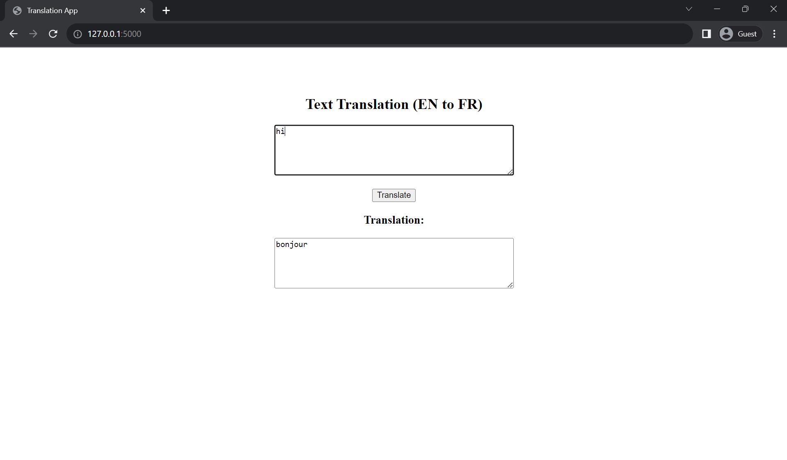

# Voxa
*The Voxa Language Translation Service*

Voxa is an easy-to-use Python package designed to translate text. 

## Table of Contents
- [Getting Started 🚀](#getting-started-🚀)
- [Usage 📖](#usage-📖)
- [Multi-tasking 🔥](#multi-tasking-🔥)
- [Example Usage for a Flask Website 🌐](#example-usage-for-a-flask-website-🌐)

## Getting Started 🚀
To get started, install Voxa with pip:
```bash
pip install voxa
```

## Usage 📖
Using Voxa is straightforward. Below is a quick example to translate an English text into French:
```python
import voxa

translator = voxa.Translator(source='en', target='fr')

translated_text = translator.translate("Hello")

print(translated_text)
```

# Multi-tasking 🔥
```python
import voxa

# Create a Translator object with default languages
translator = voxa.Translator(source='en', target='fr')

# Translate "Hello" from English to French
translated_text = translator.translate("Hello")

# For one-off translations with different languages
spanish_translation = translator.translate("Hello", target='es')

print("Translation (English to French):", translated_text)
print("Translation (English to Spanish):", spanish_translation)
```

## Example Usage for a Flask Website 🌐
To integrate Voxa in a Flask website, you can set up a simple form for users to input text and then display the translated version. Here's a basic implementation using Flask:

```python
from flask import Flask, render_template_string, request
import voxa

app = Flask(__name__)
translator = voxa.Translator(source='en', target='fr')

TEMPLATE = """
<!doctype html>
<html lang="en">
<head>
    <meta charset="utf-8">
    <meta name="viewport" content="width=device-width, initial-scale=1, shrink-to-fit=no">
    <title>Translation App</title>
</head>
<body>

<div style="text-align:center; padding: 50px;">
    <h2>Text Translation (EN to FR)</h2>

    <form action="/" method="post">
        <textarea name="text_to_translate" rows="5" cols="50" placeholder="Enter English text here...">{{ original_text }}</textarea>
        <br><br>
        <input type="submit" value="Translate">
    </form>

    <h3>Translation:</h3>
    <textarea rows="5" cols="50" readonly>{{ translation }}</textarea>
</div>

</body>
</html>
"""

@app.route('/', methods=['GET', 'POST'])
def index():
    translation = ""
    original_text = ""

    if request.method == 'POST':
        original_text = request.form.get('text_to_translate')
        if original_text:
            translation = translator.translate(original_text)

    return render_template_string(TEMPLATE, original_text=original_text, translation=translation)

if __name__ == '__main__':
    app.run(debug=True)
```

For this Flask website, when a user enters text in the textbox and clicks the "Translate" button, the text is sent to the server via a POST request. The server then uses the Voxa to translate the input text from English to French and displays the result back to the user in a readonly textbox.

You can see the file [here](flask-app.py).